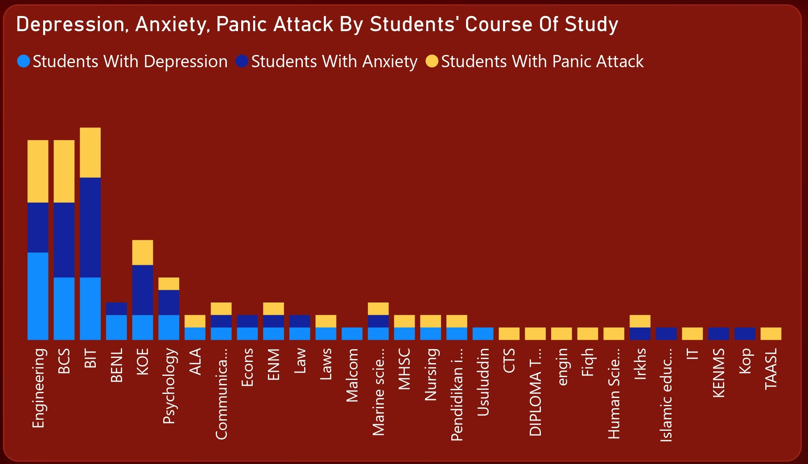

# Students Mental Health Analysis

## Project Overview

### Introduction:
The mental health of students has become a significant concern in educational institutions worldwide. With increasing academic pressure, social challenges, and lifestyle changes, understanding and addressing students' mental health needs have become imperative. This project aims to analyze various factors influencing students' mental health, identify patterns, and provide insights for interventions and support systems. This analysis project could be termed as a statiastical research on the effects of mental health on students' CGPA.

### Objectives:
- Investigate the prevalence of mental health issue of depression among students by demography (gender).
- Investigate the prevalence of anxiety mental health issues among students by demography (gender).
- Investigate the prevalence of mental health issue of panic attack among students by demography (gender).
- Evaluate students response to visiting a specialist by students gender.
- Evaluate students mental health conditions (depression, anxiety, panic attacks), among students by the marital status demography.
- Explore the trend of depression, anxiety, and panic attack mental health issues among students using the demography of age.
- Analyze the trend of mental health issues (depression, anxiety, panic attacks) among students by students year of study.
- Analyze the trend of depression, anxiety, and panic attack mental health issues among students using the students course of study.

### Expected Outcomes:

- Identification of gender disparities in the prevalence of depression among students, providing insights into potential demographic risk factors.
- Analysis of gender-based variations in the prevalence of anxiety among students, contributing to an understanding of mental health disparities.
- Exploration of gender-specific patterns in the prevalence of panic attacks among students, informing targeted interventions and support strategies.
- Evaluation of gender differences in students' response to visiting mental health specialists, potentially uncovering barriers to seeking professional help.
- Assessment of the relationship between marital status and mental health conditions (depression, anxiety, panic attacks) among students, highlighting potential vulnerabilities within specific demographic groups.
- Identification of age-related trends in depression, anxiety, and panic attack prevalence among students, facilitating age-sensitive mental health interventions and support systems.
- Analysis of the association between students' year of study and mental health issues (depression, anxiety, panic attacks), providing insights into the impact of academic progression on mental well-being.
- Examination of the relationship between students' course of study and mental health conditions (depression, anxiety, panic attacks), offering insights into discipline-specific stressors and mental health needs.

### Dataset Overview
This dataset containing useful data of 101 students used for this analysis. The dataset comprises of vital information crucial for a deep insight into the contributory factors of demography, social and and environmental factors on students' mental well-being. This Data set was collected by a survey conducted by Google Forms from University students to examine 
their current academic situation and mental health.

This dataset is a CSV file which comprises of a single table named 
Student Mental Health" and was provided by [Quantum Analytics](https://www.quantumanalyticsco.org/). You can click on this [link](Student%20Mental%20health.csv) to preview the raw data file. This dataset is made up of 11 fields and 101 rows of ports data.

Detailed information about the fields in this dataset is provided below for a better understanding of this analysis:
- __Timestamp:__ This field records the date and time when the respondent filled out the survey or questionnaire. It provides information about the timing of data collection and can be used for tracking temporal patterns or trends in mental health responses.
- __Choose your gender:__ This field captures the gender identity of the respondent. It typically includes options such as male and female. Gender is an important demographic variable that may influence mental health experiences and outcomes.
- __Age:__ This field records the age of the respondent in years. Age is a crucial demographic variable as mental health issues may vary across different life stages. Younger individuals may face distinct stressors compared to older individuals, and age-related trends in mental health can provide valuable insights for intervention strategies.
- __What is your course?:__ This field indicates the academic course or program in which the respondent is enrolled. It provides information about the academic domain or field of study pursued by the student, which can influence the types of stressors and challenges they encounter. For example, students in STEM (Science, Technology, Engineering, and Mathematics) fields may face different academic pressures compared to students in humanities or social sciences.
- __Your current year of Study:__ This field denotes the current academic year or level of study of the respondent (e.g., year 1, year 2, year 3, and year 4). Academic progression can impact students' exposure to academic stressors, workload, and social dynamics, which may influence their mental health status.
- __What is your CGPA?:__ This field represents the Cumulative Grade Point Average (CGPA) of the respondent. CGPA is a measure of academic performance based on the grades achieved in courses over a specified period. Academic performance may be associated with mental health outcomes, as students experiencing academic difficulties may face increased stress and anxiety.
- __Marital status:__ This field indicates the marital status of the respondent, which include the options: single and married. Marital status can be a significant demographic variable affecting mental health, as individuals in different marital statuses may have varying levels of social support and stressors.
- __Do you have Depression?:__ This field captures whether the respondent self-reports experiencing symptoms of depression. Depression is a common mental health condition characterized by persistent feelings of sadness, hopelessness, and loss of interest or pleasure in activities. This binary variable indicates the presence or absence of depression symptoms based on the respondent's self-assessment.
- __Do you have Anxiety?:__ This field indicates whether the respondent self-reports experiencing symptoms of anxiety. Anxiety is characterized by excessive worry, fear, and physiological arousal. Similar to depression, this binary variable denotes the presence or absence of anxiety symptoms based on the respondent's self-assessment.
- __Do you have Panic attack?:__ This field captures whether the respondent self-reports experiencing panic attacks. Panic attacks involve sudden and intense periods of fear or discomfort, accompanied by physical symptoms such as rapid heartbeat, sweating, and shortness of breath. This binary variable indicates the presence or absence of panic attack episodes based on the respondent's self-report.
- __Did you seek any specialist for a treatment?:__ This field indicates whether the respondent sought professional help from a specialist (e.g., psychiatrist, psychologist, counselor) for the treatment of mental health issues such as depression, anxiety, or panic attacks. Seeking specialist treatment is an important indicator of help-seeking behavior and access to mental health services.

### Skills Utilized
1. Data Cleaning
2. Data Modelling
3. Data Visualiziation
4. Descriptive Analytics
5. Critical Thinking and Problem Solving
6. Communication and Reporting

### Tools Used
1. Power Query Editor
    - Was used to:
        1. Extract,
        2. Transform,
        4. Load all the datasets for this analysis.
           
2. Power BI (Was used to create reports and dashboard for this analysis)
    - The following Power BI Features were incorporated:
        1. DAX
        2. Quick Measures
        3. Page Navigation
        4. Filters
        5. Tooltips

### Data Cleaning, Transformation and Loading using MS Sql Server:
- There was no serious data cleaning or transformastion carried out here. The dataset came cleaned, i just made sure that the data types of the fields are of the right types and that fields all reported 100% valid for the column quality.

**Power Query View**

Power Query Screenshot                                                             |                                
:---------------------------------------------------------------------------------:|

You can access the complete Power BI project document [here](STUDENTS%20MENTAL%20HEALTH%20ANALYSIS.pbix).

## Data Modelling
No data modelling was required since we needed just a table for the analysis.

## Visualization in Power BI:
#### Report View

### Project Analysis:
From the analysis, i made the following Key findings below:
- The Number of Students is __101.__
- The Average Age of Students is __21.__
- Number of Students With Depression is __35.__
- Number of Students With Anxiety is __34.__
- Number of Students With Panic Attack is __33.__
- Number of Students that Seeked Specialist Attention is __6.__

- 
- **Number of Students With Depression By Gender:**
- In this analysis, our first insight is on the number of students with depression by gender, below are insights i derived from the data:
- __Gender Distribution:__ The data shows that out of the total number of students with depression, 29 (82.86%) are female, while 6 (17.14%) are male. There is a notable disparity in the number of female students reporting depression compared to male students.
- __Gender Disparities in Depression:__ The significantly higher percentage of female students experiencing depression suggests a gender disparity in mental health outcomes. This finding aligns with existing research indicating that females are more likely to experience depression compared to males. Factors such as hormonal differences, societal expectations, and coping mechanisms may contribute to this disparity.
- __Implications for Mental Health Support:__ The higher prevalence of depression among female students underscores the importance of gender-sensitive mental health support services within educational institutions. Educational institutions should consider implementing targeted interventions and support programs tailored to the specific needs and challenges faced by female students. Awareness campaigns and outreach efforts focused on reducing stigma surrounding mental health issues, particularly among female students, may be beneficial.

- 
- **Number of Students With Anxiety By Gender:**
- This data offers insights into the prevalence of anxiety among students, segmented by gender. Here's an analysis of the data and key takeaways:
- __Gender Distribution:__ The data reveals that out of the total number of students experiencing anxiety, 24 (70.59%) are female, while 10 (29.41%) are male. The majority of students reporting anxiety are female, indicating a gender disparity in anxiety prevalence.
- __Gender Disparities in Anxiety:__ The higher percentage of female students experiencing anxiety aligns with existing research highlighting that females tend to be more susceptible to anxiety disorders compared to males. Societal expectations, hormonal factors, and coping mechanisms may contribute to this gender disparity in anxiety prevalence among students.
- __Implications for Mental Health Support:__ The data underscores the importance of implementing gender-sensitive mental health support services within educational institutions, with a specific focus on addressing anxiety among female students. Targeted interventions, counseling services, and awareness campaigns tailored to the unique needs of female students may be crucial in mitigating anxiety-related challenges.

- 
- **Number of Students With Panic Attack By Gender:**
- The prevalence of panic attacks among students, categorized by gender. Below is an analysis of the findings along with key insights derived from the data:
- __Gender Distribution:__ The data reveals that out of the total number of students experiencing panic attacks, 25 (75.76%) are female, while 8 (24.24%) are male. Female students constitute a majority of individuals reporting panic attacks, indicating a gender disparity in the prevalence of this mental health issue.
- __Gender Disparities in Panic Attacks:__ The higher percentage of female students experiencing panic attacks aligns with existing research indicating that females are more susceptible to anxiety-related disorders, including panic attacks, compared to males. Socio-cultural factors, biological differences, and coping mechanisms may contribute to this gender disparity in panic attack prevalence among students.
- __Implications for Mental Health Support:__ The data underscores the importance of gender-sensitive mental health support services within educational institutions, particularly in addressing panic attacks among female students. Targeted interventions, such as cognitive-behavioral therapy (CBT) and stress management techniques, tailored to the unique needs of female students, may be beneficial in managing panic attacks.

- 
- **Number of Students That Visited A Specialist:**
- This data offers insights into the number of students who visited a specialist for mental health treatment, segmented by gender. Below is an analysis of the findings along with key insights derived from the data:
- __Gender Distribution:__ The data indicates that out of the total number of students who visited a specialist for mental health treatment, 5 are female, while only 1 is male. Female students constitute the majority of individuals seeking specialist treatment, suggesting a gender disparity in help-seeking behavior for mental health concerns.
- __Gender Disparities in Help-Seeking Behavior:__ The higher percentage of female students visiting a specialist for mental health treatment aligns with existing research indicating that females are more likely to seek help for mental health issues compared to males. Societal norms, stigma surrounding mental health, and traditional gender roles may influence help-seeking behavior, leading to disparities in accessing specialist treatment.
- __Implications for Mental Health Support:__ The data underscores the importance of addressing barriers to help-seeking behavior, particularly among male students, who may be less likely to seek professional treatment for mental health concerns. Educational institutions should prioritize initiatives aimed at reducing stigma, raising awareness about available mental health services, and promoting a supportive environment where students feel comfortable seeking help.

- 
- **Students With Mental Health Condition By Students Marital Status:**
- This analysis is on the prevalence of mental health conditions (anxiety, depression, panic attacks) among students, categorized by marital status. Below is an analysis of the findings along with key insights derived from the data:
- __Anxiety:__ Among students who are not married, 27 individuals (the highest count) report experiencing anxiety, while among married students, 7 individuals report anxiety. The higher number of students experiencing anxiety among those who are not married suggests that marital status may influence anxiety prevalence. This finding could be attributed to various factors such as relationship status, social support networks, and stressors associated with romantic relationships.
- __Depression:__ Students who are not married also exhibit a higher prevalence of depression, with 19 individuals reporting depression compared to 16 individuals among married students.
Marital status may impact depression prevalence due to differences in life circumstances, social support, and coping mechanisms between married and unmarried individuals. Unmarried students may experience unique stressors related to academic pressures, career uncertainty, and interpersonal relationships, which could contribute to higher rates of depression.
- __Panic Attacks:__ The data shows that among students who are not married, 23 individuals report experiencing panic attacks, while among married students, 10 individuals report panic attacks. Marital status may play a role in panic attack prevalence, with unmarried students potentially facing heightened stressors related to personal and academic pressures. Factors such as financial concerns, social isolation, and relationship difficulties may contribute to the higher prevalence of panic attacks among unmarried students.
- __Implications for Mental Health Support:__ The data underscores the importance of considering marital status as a potential risk factor for mental health conditions among students.
Educational institutions should develop tailored support programs and interventions that address the unique needs of students based on their marital status. Providing resources for stress management, relationship counseling, and mental health education can help mitigate the impact of marital status on mental health outcomes among students.

- 
- **Depression, Anxiety and Panic Attack Trend By Students Age:**
- This is an analysis on prevalence of mental health conditions (anxiety, depression, panic attacks) among students, categorized by age. Below is an analysis of the findings along with key insights derived from the data:
- __Anxiety:__ The data reveals variations in the prevalence of anxiety across different age groups. The highest number of students experiencing anxiety is observed at age 18 (14 students), followed by a decline in subsequent age groups.This trend suggests that anxiety prevalence may peak during late adolescence, coinciding with major life transitions such as entering college or university. Factors such as academic pressure, social challenges, and identity formation during this period may contribute to heightened anxiety levels among younger students.
- __Depression:__ The data indicates fluctuations in the prevalence of depression across different age groups. Depression prevalence is highest at age 18 (11 students) and age 24 (6 students), with lower counts observed in intervening age groups. The peak in depression prevalence at age 18 may reflect the challenges associated with the transition from adolescence to adulthood, while the increase at age 24 could be attributed to the stressors of early adulthood, such as career decisions and financial independence.
- __Panic Attacks:__ Similar to anxiety and depression, the data shows variations in the prevalence of panic attacks across different age groups. The highest number of students experiencing panic attacks is observed at age 18 (9 students), with fluctuating counts in subsequent age groups. The peak in panic attack prevalence at age 18 may be linked to the heightened stress and uncertainty associated with the transition to adulthood, including academic demands and social pressures. The decline in panic attack prevalence in older age groups may reflect a reduction in acute stressors or improved coping mechanisms as students mature.
- __Implications for Mental Health Support:__ The data highlights the importance of age-specific interventions and support services to address the mental health needs of students at different stages of development. Educational institutions should implement targeted programs aimed at promoting mental well-being and resilience, particularly during transitional periods such as the transition from adolescence to adulthood. Early identification of mental health issues and timely intervention can help mitigate the negative impact of anxiety, depression, and panic attacks on students' academic performance and overall well-being.

- 
- **Depression, Anxiety and Panic Attack Trend By Students Year of Study:**
- This analysis focuses on the prevalence of mental health conditions (anxiety, depression, panic attacks) among students, categorized by their year of study. Below is an analysis of the findings along with key insights derived from the data:
- __Anxiety:__ The data reveals variations in the prevalence of anxiety across different years of study. The highest number of students experiencing anxiety is observed in Year 1 (14 students), with decreasing counts in subsequent years. This trend suggests that anxiety prevalence may be highest among first-year students, possibly due to the transition to university or college, academic pressure, and social adjustment challenges. As students progress through their academic journey, they may develop coping mechanisms and resilience to manage anxiety, leading to a decline in prevalence in later years of study.
- __Depression:__ Similar to anxiety, the data indicates fluctuations in the prevalence of depression across different years of study. The highest number of students experiencing depression is observed in Year 1 (14 students), with varying counts in subsequent years. The peak in depression prevalence among first-year students may be attributed to the stressors associated with adjusting to a new academic environment, separation from family and friends, and academic demands. 
- __Panic Attacks:__ The data shows variations in the prevalence of panic attacks across different years of study, with the highest number of students experiencing panic attacks in Year 1 (14 students). The peak in panic attack prevalence among first-year students may be linked to the stress and uncertainty associated with transitioning to university or college, including academic expectations, social pressures, and financial concerns. Similar to anxiety and depression, the prevalence of panic attacks tends to decrease in subsequent years of study as students adapt to their academic environment and develop coping strategies.
- __Implications for Mental Health Support:__ The data highlights the importance of providing targeted mental health support and interventions for students, particularly during the transition to university or college. Educational institutions should implement proactive measures to address mental health concerns among first-year students, including orientation programs, peer support groups, and access to counseling services.

- 
- **Depression, Anxiety and Panic Attack Trend By Students Course of Study:**
